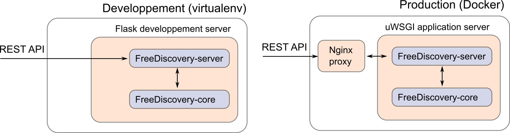

# Deployment options





## 1. Starting FreeDiscovery as a daemon

The easiest way of running FreeDiscovery as a background service on Linux / MacOS is by using [supervisor](http://supervisord.org/index.html),

 1. Create a dedicated user account (to avoid running the server as `root`),
    ```
    sudo useradd -r freediscovery
    ```
 2. [Install supvervisor](http://supervisord.org/installing.html#installing-a-distribution-package), for instance
    ```
    sudo apt-get install supervisor
    ```
    on a Debian/Ubuntu based system. Make sure supervisor is started with,
    ```
    sudo service supervisor start
    ```
    
 3. Configure supervisor to launch FreeDiscovery by adding creating a new service definition file `/etc/supervisor/conf.d/freediscovery.conf`
    ```
    [program:freediscovery]
    command=<freediscovery_excutable_path> run --cache-dir /srv/freediscovery_shared/ -y --hostname 0.0.0.0 -p 5001 --log-file /var/log/freediscovery/freediscovery.backend.log
    directory=/
    autostart=true
    autorestart=true
    startretries=1
    redirect_stderr=true
    stdout_logfile=/var/log/freediscovery/freediscovery.stdout.log
    user=freediscovery
    ```
    where `<freediscovery_excutable_path>` is the absolute path to the FreeDiscovery executable (can be found with `which freediscovery`). You should customize the `comand` options as needed (see `freediscovery run --help`). If you are running freediscovery with the `--hostname 0.0.0.0` (i.e. connection open from anywhere) make sure the server has a configured firewall.

 4. Give the `freediscovery` user the necessary permissions,
    ```
    sudo mkdir /srv/freediscovery_shared/
    sudo chown freediscovery /srv/freediscovery_shared/
    sudo mkdir /var/log/freediscovery/
    sudo chown freediscovery /var/log/freediscovery/
    ```

 5. Reload the configuration,
    ```
    sudo supervisorctl reread
    sudo supervisorctl update
    ```
    and check that freediscovery service is running,
    ```
    sudo supervisorctl
    ```
    Going to `http://<server_ip>:<fd_port_number>` in a browser should also yield version information about the running FreeDiscovery server.

 6. The FreeDiscovery service will auto-launch at startup. It can also be manually started/stopped with,
    ```
    sudo supervisorctl [start|stop] freediscovery
    ```
    Please refer to [this post](https://serversforhackers.com/c/monitoring-processes-with-supervisord) for a quick supervisor tutoral, or to [supervisor documentation](http://supervisord.org/index.html) for additional details.


