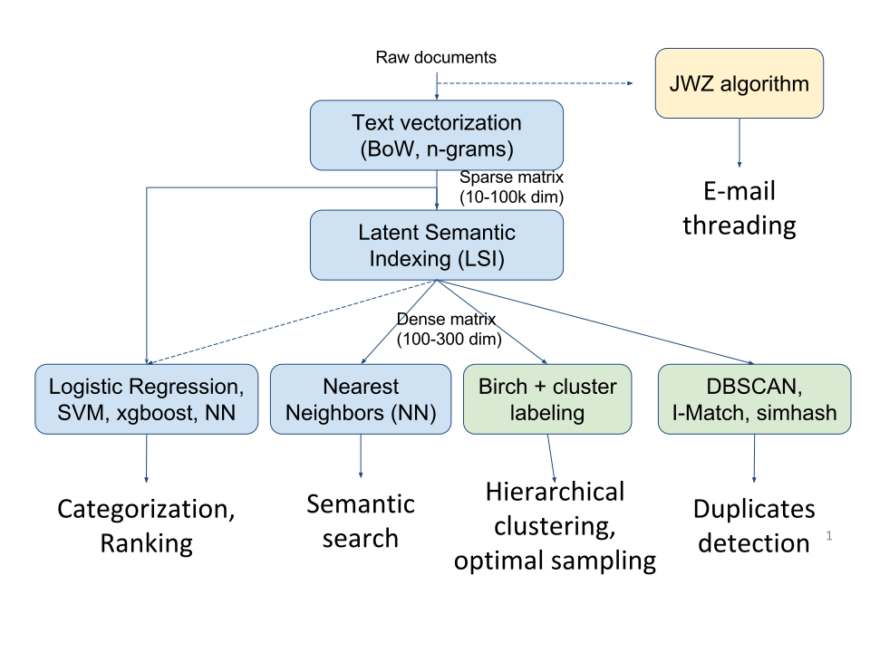

FreeDiscovery overview
======================

The typical processing flow with FreeDiscovery is illustrated on the figure below,

  FreeDiscovery processing overview

Which algorithms work in the LSI space?
^^^^^^^^^^^^^^^^^^^^^^^^^^^^^^^^^^^^^^^

We typically start by vectorizing documents with a Bag of Words or an n-gram model. This produces a sparse vector for each document. Given some training documents, we can then directly train categorization model on this sparse representation. This works for,

  * all categorization algorithms (Logistic Regression, Linear SVC, Gradient Boosting, etc) excluding Nearest Neighbors.
  * the I-Match duplicate detection algorithm 

In order to get a more meaningful similarity between documents, we compute the Latent Semantic Indexing (LSI) of the dataset which produces a dense vector for each document. Using this LSI representation we can then, use

  * the Nearest Neighbors algorithm for categorization or semantic search
  * compute hierarchical clustering
  * apply the DBSCAN duplicate detection 

The optimal sampling can be to provide a good initial training document set for categorization. It is a special case of the Birch algorithm and also needs to be computed in the LSI space.

.. note::

   The usage of LSI is not strictly enforced in FreeDiscovery. For instance, it is possible to use Logistic Regression in the LSI space, although it is not recommended. In the same way, one can run DBSCAN or NearestNeighboors algorithm althought this will be much slower and will not produce very good results. 
   
   Generally any algorithm that relies on the notion of similarity between documents should be used in the LSI space in order to produce meaningful similarities. The only exception is NearestNeighbors, that can also be used for non-semantic search.

